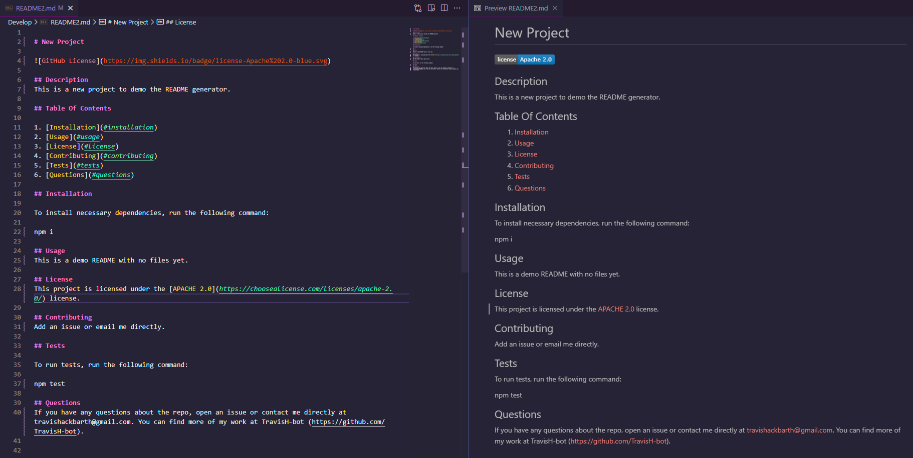

# Professional-README-Generator

## Description

- What was your motivation?

  The motivation behind the project was to generate a README file based on user answers to a prompt within the terminal.

- Why did you build this project?

  The project was created to test what was learned in the lessons and projects learned up to this point, with an emphasis on Node.js, ES6 syntax, template literals, and NPM.

- What problem does it solve?

  The problem this project solves is the ability to generate a README file based on answers to a prompt. This allows for time to be saved when creating future projects.

- What did you learn?

  During this project, I have learned how to accurately use node.js, template literals to inject formatting into a file, and linking two js files together with the use of exporting.

I have also learned how to incorporate shields.io into my projects README.

## Table of Contents 

1. [Installation](#installation)
2. [Usage](#usage)
3. [Credits](#credits)
4. [Badges](#badges)

## Installation

In order to install the project, an installation of [inquirer](https://www.npmjs.com/package/inquirer) in needed.

## Usage

1. Users will need to install Inquirer v8.2.4.


2. Once in the repository, they will run the command:

```
node index.js
```


3. Users will then answer the following prompts to create their custom README file.


4. Once all questions have been answered, the newly generated README will be displayed in their repository.



The following video will demonstrate how the project is used.

https://drive.google.com/file/d/1oBsN9zR7t7jaACJyxeLOxy00WE130c23/view

## Credits

Most of the project was created with the aid of the previous lessons and the mini-project leading up to the challenge.

I used a tutorial found on [medium.com](https://javascript.plainenglish.io/how-to-make-custom-language-badges-for-your-profile-using-shields-io-d2aeaf016b6b) to help learn the formatting to add the [shields.io](https://shields.io/) badges as well as the [shields.io](https://shields.io/) site as well.

## Badges


Badges are used in the generation of the README file itself and one for demonstration here.
